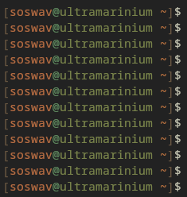
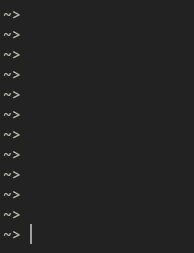
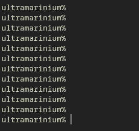
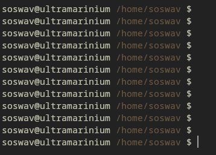
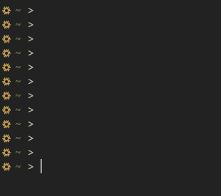

# s-zsh
*"soswavified z-shell for the wicked"*

needs:
```diff
+ zsh            (duh)
+ eza            (optional)
+ a fetch tool   (optional)
+ a brain        (optional)
```

## yeah yeah, but how do i install it?
simple! just clone the repository and move all the files *(.zshrc and .zsh)* to your home directory

```sh
cd ; git clone --depth 1 https://github.com/soswav/zsh
```
considering that you're **not** using the installer, you probably already know some stuff about your terminal!

now, just move the old `.zshrc` file to whereever you want as i **seriously** want you to backup your stuff!

now that you've done that, just run:
```sh
mv ~/zsh/.zsh ~ ; mv ~/zsh/.zshrc ~
```
that should move the files to your home folder; now just source your .zshrc while using zsh (if you haven't restarted your session yet)

## nah, i'm too lazy for cloning and moving the files a bit
1. first of all: alright..
2. second of all: sure!

just run this in your terminal:
```sh
cd $HOME ; curl -O https://codeberg.org/soswav/zsh/raw/branch/main/installer.sh ; chmod u+x installer.sh ; ./installer.sh
```
>[!WARNING]
> consider reading the script first! don't trust random scipts!

ehem, it sends you to your home directory, downloads the installer, makes it executable, and executes it!

## this is atrocious
open a issue and tell me what i should improve then! feel free to contribute also!

### themes? what??
i'm currently attempting to make good-looking themes for the config, here's what *some* of them look like:







>[!NOTE]
>ignore my screenshot skills
